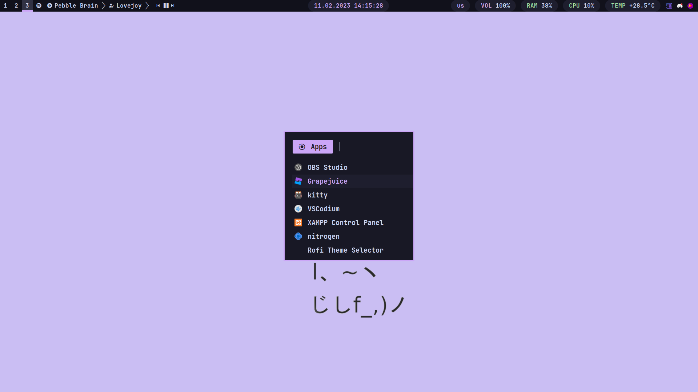

# dotfiles
This config is based on [ejvi's dotfiles](https://github.com/ejvi/dotfiles), except I've added some of my own stuff.

- OS: arch linux
- Shell: zsh
- Terminal: kitty
- Launcher: rofi
- Bar: polybar
- Font: jetbrains mono nerd font
- Wallpaper: mauve-cat from catppuccin wallpaper repo
- Catppuccin Variation: Mocha Mauve

# Dependencies
- i3-gaps
- picom
- neofetch
- micro
- polybar
- kitty
- zsh
- rofi
- exa
- flameshot
- playerctl
- [mpris](https://aur.archlinux.org/packages/mpris-ctl)
- [zscroll](https://aur.archlinux.org/packages/zscroll-git)
- [catppuccin cursors](https://github.com/catppuccin/cursors)
- [catppuccin icon theme](https://github.com/catppuccin/papirus-folders)

# Screenshots

	

	

	

# ToDo
Important:
- ~~fix spotify player in bottom bar~~
- add install file
- add power menu to rofi

Extra:
- ~~make polybar more prettier~~
