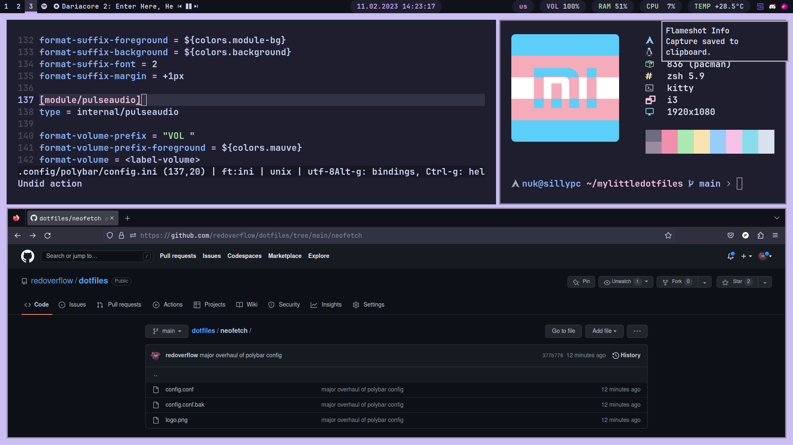

# dotfiles
This config is based on [ejvi's dotfiles](https://github.com/ejvi/dotfiles), except I've added some of my own stuff.

OS: arch linux
Shell: zsh
Terminal: alacritty
Launcher: rofi
Bar: polybar
Font: jetbrains mono nerd font
Wallpaper: mauve-cat from catppuccin wallpaper repo
Catppuccin Variation: Mocha Mauve

# Dependencies
- i3-gaps
- picom
- neofetch
- micro
- polybar
- alacritty
- zsh
- rofi
- exa

# Screenshots

	

	

# ToDo
Important:
- fix spotify player in bottom bar
- add install file
- make polybar prettier
- add power menu to rofi

Extra:
- make polybar more prettier (e.g. make the stuff on the right be in little round rectangles with different bgs)
